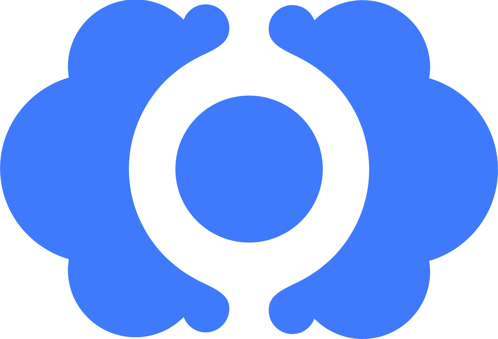

<p align="center" style="margin: -50px 0">
  
</p>

<h1 align="center" style="font-size: 60px; font-weight: bold;">CloudCannon Snippets</h1>

## Snippets

Features the following snippets (type the text in bold in your editor)


<!-- AUTO-GENERATED-CONTENT:START (API) -->
### React
- **'react-component'** - Creates a quick general React component
- **'useEffect'** - Creates a useEffect snippet in browser
- **'react-emotion-component'** - Creates a quick emotion component

### Typescript
- **'class' or 'typescript-class'** - Creates a quick typescript class
- **'promise'** - A new ES6 promise

### SASS
- **'svg-background'** - Creates an svg background image in sass/css
- **'media'** - Creates a media query
- **'svg-background'** - Creates an svg background image in sass/css
- **'skeleton' or 'spooky-scary-skeletons'** - Creates a CSS/SASS skeleton

### Webpack
- **'react-webpack'** - A webpack starter for node importing projects
- **'webpack-umd' or 'react-webpack-umd'** - A webpack starter compiling to UMD
<!-- AUTO-GENERATED-CONTENT:END (API) --> 

## Usage

Install the extension, and then you will have access to the snippets :).

## Local development

You can create a snippet in `snippets/index.snippet.toml`, and then run `npm run build`. 
This will create a new snippet in `dist/snippets.code-snippets` which you can copy and paste
into your [user snippets folder](https://code.visualstudio.com/docs/editor/userdefinedsnippets#_create-your-own-snippets).

You will then be able to run the snippets locally.

If you are happy with the snippet, create a PR for it :).

## Deploy

Simply commit with a message that matches [semantic release](https://github.com/semantic-release/semantic-release). 

e.g.
```bash
git commit -m "feat: added snippet"
```

Then check Github Actions. If this succeeds, 
the extension will be published immediately on the Visual Studio marketplace.

